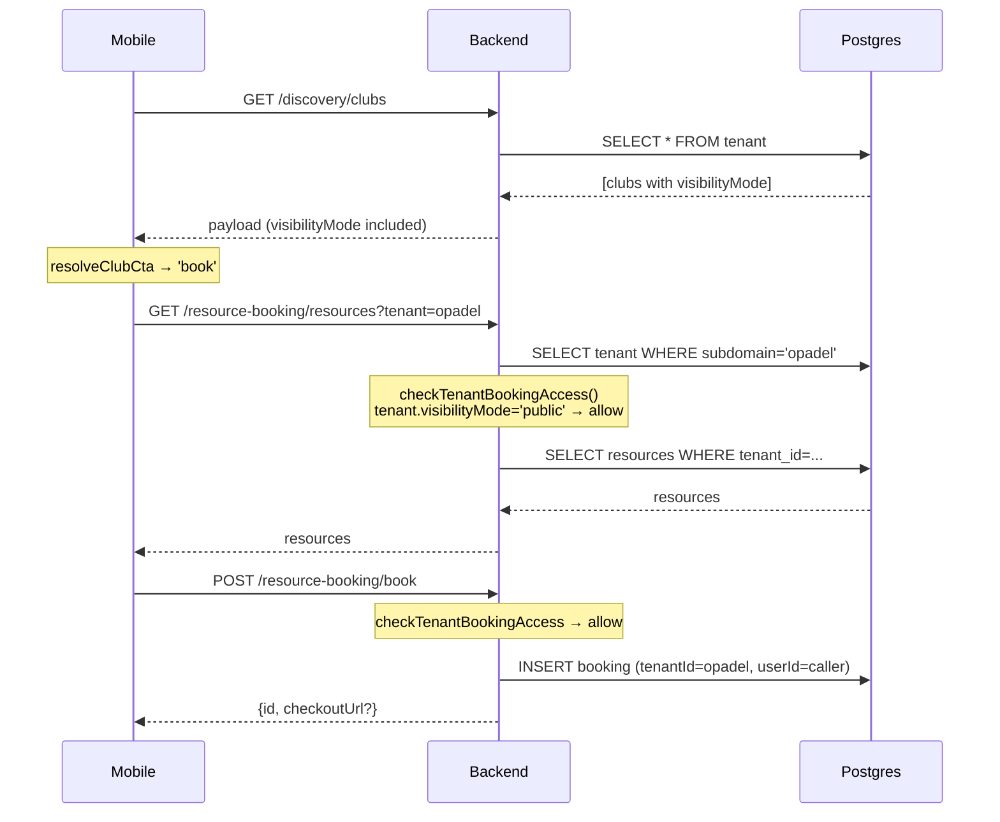
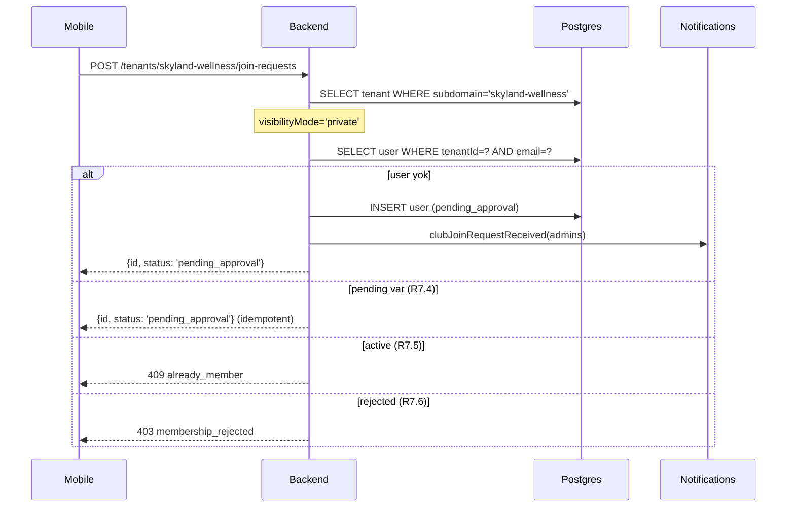
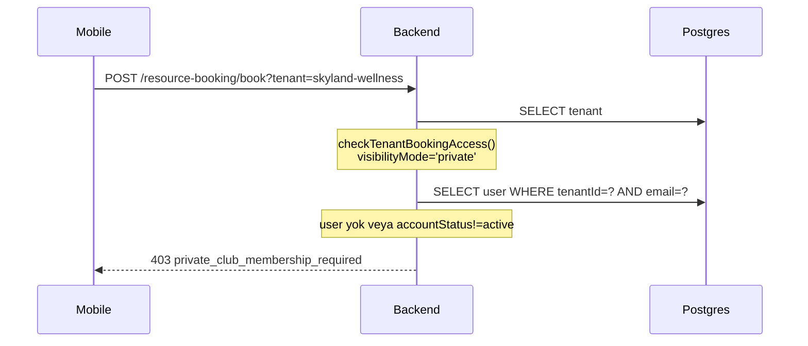

# Technical Design — Partner Club Visibility

## 1. Overview

Bu tasarım, **partner kulüplere public/private görünürlük modeli** ekler. Değişiklik minimum invasive: mevcut `Tenant`, `User`, `Booking` tablolarını korur, sadece `tenant` tablosuna bir enum sütunu ve iki endpoint ekler. Authorization mantığı tek bir yardımcı fonksiyonda toplanır, böylece P2 (booking authorization invariant) her yerden tutarlı şekilde uygulanabilir.

Hedef: yeni migrasyonla üretimi kırmadan, mevcut `opadel` tenant'ını `public` yapmak; diğer tüm kulüpleri varsayılan olarak `private` bırakmak (güvenli varsayılan).

## 2. Veritabanı Değişiklikleri

### 2.1 `tenant` tablosu

Yeni sütun:

```sql
ALTER TABLE tenant
  ADD COLUMN visibility_mode VARCHAR(10) NOT NULL DEFAULT 'private';

ALTER TABLE tenant
  ADD CONSTRAINT tenant_visibility_mode_check
  CHECK (visibility_mode IN ('public', 'private'));

CREATE INDEX idx_tenant_visibility ON tenant(visibility_mode)
  WHERE visibility_mode = 'public';
```

Partial index sadece `public` için tutuluyor çünkü public tenant sayısı çok daha az olacak ve discovery/booking sorgularında filtre olarak kullanılabilir.

### 2.2 Audit log

Yeni tablo:

```sql
CREATE TABLE tenant_visibility_audit (
  id UUID PRIMARY KEY DEFAULT uuid_generate_v4(),
  tenant_id UUID NOT NULL REFERENCES tenant(id) ON DELETE CASCADE,
  changed_by_user_id UUID REFERENCES "user"(id) ON DELETE SET NULL,
  previous_value VARCHAR(10) NOT NULL,
  new_value VARCHAR(10) NOT NULL,
  source VARCHAR(20) NOT NULL, -- 'club_admin' | 'platform_admin'
  changed_at TIMESTAMPTZ NOT NULL DEFAULT NOW()
);

CREATE INDEX idx_tenant_visibility_audit_tenant ON tenant_visibility_audit(tenant_id, changed_at DESC);
```

Ayrı tablo tercih edildi çünkü:
- Platform-wide generic audit log yapısı henüz yok
- Küçük, hedefli tablo sorgulaması kolay
- İleride daha geniş audit altyapısı kurulduğunda migrate edilmesi kolay

### 2.3 Migration dosyası

`backend/src/database/migrations/<timestamp>-AddTenantVisibilityMode.ts`:

```typescript
import { MigrationInterface, QueryRunner } from 'typeorm';

export class AddTenantVisibilityMode<timestamp> implements MigrationInterface {
  public async up(qr: QueryRunner): Promise<void> {
    // 1. visibility_mode column
    await qr.query(`
      ALTER TABLE tenant
      ADD COLUMN IF NOT EXISTS visibility_mode VARCHAR(10) NOT NULL DEFAULT 'private'
    `);
    await qr.query(`
      ALTER TABLE tenant
      ADD CONSTRAINT tenant_visibility_mode_check
      CHECK (visibility_mode IN ('public', 'private'))
    `);
    await qr.query(`
      CREATE INDEX IF NOT EXISTS idx_tenant_visibility
      ON tenant(visibility_mode) WHERE visibility_mode = 'public'
    `);

    // 2. audit table
    await qr.query(`
      CREATE TABLE IF NOT EXISTS tenant_visibility_audit (
        id UUID PRIMARY KEY DEFAULT uuid_generate_v4(),
        tenant_id UUID NOT NULL REFERENCES tenant(id) ON DELETE CASCADE,
        changed_by_user_id UUID REFERENCES "user"(id) ON DELETE SET NULL,
        previous_value VARCHAR(10) NOT NULL,
        new_value VARCHAR(10) NOT NULL,
        source VARCHAR(20) NOT NULL,
        changed_at TIMESTAMPTZ NOT NULL DEFAULT NOW()
      )
    `);
    await qr.query(`
      CREATE INDEX IF NOT EXISTS idx_tenant_visibility_audit_tenant
      ON tenant_visibility_audit(tenant_id, changed_at DESC)
    `);

    // 3. opadel public (R2.2)
    await qr.query(`
      UPDATE tenant SET visibility_mode = 'public' WHERE subdomain = 'opadel'
    `);
  }

  public async down(qr: QueryRunner): Promise<void> {
    await qr.query(`DROP TABLE IF EXISTS tenant_visibility_audit`);
    await qr.query(`DROP INDEX IF EXISTS idx_tenant_visibility`);
    await qr.query(`ALTER TABLE tenant DROP CONSTRAINT IF EXISTS tenant_visibility_mode_check`);
    await qr.query(`ALTER TABLE tenant DROP COLUMN IF EXISTS visibility_mode`);
  }
}
```

TypeORM default transactional migration'lar sayesinde R2.5 (rollback on failure) otomatik karşılanır.

## 3. Entity Değişiklikleri

`backend/src/database/entities/tenant.entity.ts`:

```typescript
export type TenantVisibilityMode = 'public' | 'private';

@Entity({ name: 'tenant' })
export class Tenant {
  // ... mevcut alanlar ...

  @Column({
    type: 'varchar',
    length: 10,
    default: 'private',
    name: 'visibility_mode',
  })
  visibilityMode!: TenantVisibilityMode;
}
```

Yeni audit entity:

`backend/src/database/entities/tenant-visibility-audit.entity.ts`:

```typescript
@Entity({ name: 'tenant_visibility_audit' })
export class TenantVisibilityAudit {
  @PrimaryGeneratedColumn('uuid') id!: string;
  @Column({ type: 'uuid', name: 'tenant_id' }) tenantId!: string;
  @Column({ type: 'uuid', nullable: true, name: 'changed_by_user_id' })
  changedByUserId!: string | null;
  @Column({ type: 'varchar', length: 10, name: 'previous_value' })
  previousValue!: TenantVisibilityMode;
  @Column({ type: 'varchar', length: 10, name: 'new_value' })
  newValue!: TenantVisibilityMode;
  @Column({ type: 'varchar', length: 20 })
  source!: 'club_admin' | 'platform_admin';
  @CreateDateColumn({ type: 'timestamptz', name: 'changed_at' })
  changedAt!: Date;
}
```

`backend/src/database/typeorm-entities.ts` listesine eklenecek.

## 4. Authorization Helper

Tek kaynak — P2 ve P6 garantili olsun diye:

`backend/src/resource-booking/tenant-access.util.ts`:

```typescript
import { ForbiddenException } from '@nestjs/common';
import { Repository } from 'typeorm';
import { Tenant } from '../database/entities/tenant.entity';
import { User } from '../database/entities/user.entity';
import { MemberAccountStatus } from '../database/enums';

export type TenantAccessOutcome =
  | { allow: true }
  | { allow: false; reason: 'private_club_membership_required' };

/**
 * Partner kulübe erişim kuralları (P2, P6):
 * - Public kulüp → her Platform_User izinli
 * - Private kulüp → sadece aynı email ile accountStatus = 'active' olan kullanıcı izinli
 *
 * Bu fonksiyon saf (pure) ve request sırasına bağlı değildir. Membership_Check
 * kullanıcının email'i ile target tenant'taki User satırı üzerinden yapılır.
 */
export async function checkTenantBookingAccess(
  user: User,
  tenant: Tenant,
  usersRepo: Repository<User>,
): Promise<TenantAccessOutcome> {
  // Non-partner tenant'larda visibilityMode ignore edilir (R1.5)
  const workspaceType = (tenant.settings as { workspaceType?: string } | null)
    ?.workspaceType;
  if (workspaceType !== 'partner_club') {
    return { allow: true };
  }

  if (tenant.visibilityMode === 'public') {
    return { allow: true };
  }

  // Private kulüp → Active_Membership zorunlu
  const membership = await usersRepo.findOne({
    where: {
      tenantId: tenant.id,
      email: user.email.toLowerCase(),
    },
    select: ['id', 'accountStatus'],
  });

  if (membership?.accountStatus === MemberAccountStatus.ACTIVE) {
    return { allow: true };
  }
  return { allow: false, reason: 'private_club_membership_required' };
}

/** Helper: 403 fırlat. Servis katmanında tek satırda kullanım için. */
export async function assertTenantBookingAccess(
  user: User,
  tenant: Tenant,
  usersRepo: Repository<User>,
): Promise<void> {
  const outcome = await checkTenantBookingAccess(user, tenant, usersRepo);
  if (!outcome.allow) {
    throw new ForbiddenException({
      statusCode: 403,
      error: 'Forbidden',
      code: outcome.reason,
      message: 'Bu kulüp sadece onaylı üyelerine hizmet veriyor.',
    });
  }
}
```

## 5. Servis/Kontroller Değişiklikleri

### 5.1 `ResourceBookingService`

`listResources`, `listAvailableSlots`, `listAddons`, `createBooking` metodlarının başına, tenant yüklendikten sonra:

```typescript
await assertTenantBookingAccess(user, tenant, this.usersRepo);
```

Public tenant'ta no-op, private'da 403 fırlatır. R4, R5, R10 karşılanır.

`createBooking` cross-tenant attribution (R8, P5): mevcut kod zaten `booking.tenantId = tenant.id` ve `booking.userId = user.id` yazıyor, değişiklik yok. Sadece helper çağrısı eklenecek.

### 5.2 `DiscoveryService`

`listClubs` ve `listFeaturedClubs` çıktısına `visibilityMode` ekle. Private kulüpler için public-safe alanlara sınırla (R6.3):

```typescript
return rows.map((t) => ({
  id: t.id,
  name: t.name,
  subdomain: t.subdomain,
  visibilityMode: t.visibilityMode,
  // workspaceType partner_club değilse default 'public' gibi davran
  description: t.description,
  location: t.location,
  logoUrl: t.logoUrl ?? this.extractLegacyLogo(t.branding),
  coverImageUrl: t.coverImageUrl,
  services: t.services ?? [],
  priceRange: t.priceRange,
  featured: t.featured,
  avgRating: t.avgRating,
  reviewCount: t.reviewCount,
  phone: t.phone,
  email: t.email,
  vertical: t.vertical,
}));
```

Private kulüplerin resource/slot/addon listesi zaten public discovery endpoint'inden dönmüyor, R6.3 güvenli. Resource/slot endpoint'leri kendi membership check'lerini yapıyor.

### 5.3 `AuthService.listMyMemberships`

Her entry'e `visibilityMode` ve `accountStatus` ekle (R11):

```typescript
.map((m) => ({
  membershipId: m.id,
  role: m.role,
  accountStatus: m.accountStatus,
  isCurrent: m.id === user.id,
  tenant: {
    id: m.tenant.id,
    name: m.tenant.name,
    subdomain: m.tenant.subdomain,
    logoUrl: m.tenant.logoUrl ?? null,
    location: m.tenant.location ?? null,
    services: m.tenant.services ?? [],
    featured: m.tenant.featured ?? false,
    visibilityMode: m.tenant.visibilityMode,
  },
}))
```

### 5.4 Yeni: `TenantJoinRequestController`

`backend/src/tenants/tenant-join-request.controller.ts`:

```typescript
@Controller('tenants/:subdomain/join-requests')
@UseGuards(JwtAuthGuard)
export class TenantJoinRequestController {
  constructor(private readonly service: TenantJoinRequestService) {}

  @Post()
  create(
    @CurrentUser() user: User,
    @Param('subdomain') subdomain: string,
    @Body() body: { message?: string },
  ) {
    return this.service.createJoinRequest(user, subdomain, body.message);
  }
}
```

`backend/src/tenants/tenant-join-request.service.ts`:

```typescript
@Injectable()
export class TenantJoinRequestService {
  constructor(
    @InjectRepository(Tenant) private readonly tenantsRepo: Repository<Tenant>,
    @InjectRepository(User) private readonly usersRepo: Repository<User>,
    private readonly notificationDispatcher: NotificationDispatcher,
  ) {}

  async createJoinRequest(user: User, subdomain: string, message?: string) {
    const tenant = await this.tenantsRepo.findOne({ where: { subdomain } });
    if (!tenant) throw new NotFoundException('Tenant not found');

    // R7.2: public'e join atılamaz
    if (tenant.visibilityMode === 'public') {
      throw new BadRequestException({ code: 'club_is_public' });
    }

    const existing = await this.usersRepo.findOne({
      where: { tenantId: tenant.id, email: user.email.toLowerCase() },
    });

    // R7.4: idempotent — zaten pending varsa aynı satırı dön
    if (existing?.accountStatus === MemberAccountStatus.PENDING_APPROVAL) {
      return {
        id: existing.id,
        status: 'pending_approval' as const,
        tenantSubdomain: tenant.subdomain,
      };
    }

    // R7.5: aktif üyeyse 409
    if (existing?.accountStatus === MemberAccountStatus.ACTIVE) {
      throw new ConflictException({ code: 'already_member' });
    }

    // R7.6: rejected ise 403
    if (existing?.accountStatus === MemberAccountStatus.REJECTED) {
      throw new ForbiddenException({ code: 'membership_rejected' });
    }

    // R7.3: yeni user row oluştur
    const publicId = await this.generatePublicId();
    const newUser = this.usersRepo.create({
      tenantId: tenant.id,
      email: user.email.toLowerCase(),
      username: user.username,
      publicId,
      // Re-use password hash from home tenant user — or force password reset?
      // Decision: kullanıcının ev tenant'ından aynı hash'i kopyalıyoruz,
      //          böylece aynı parola ile giriş yapabilir.
      passwordHash: user.passwordHash,
      firstName: user.firstName,
      lastName: user.lastName,
      phone: user.phone,
      photoUrl: user.photoUrl,
      role: UserRole.MEMBER,
      accountStatus: MemberAccountStatus.PENDING_APPROVAL,
      notificationPreferences: user.notificationPreferences,
    });
    await this.usersRepo.save(newUser);

    // Message opsiyonel — varsa notification data'sına koy, admin görebilsin
    void this.notificationDispatcher.clubJoinRequestReceived({
      tenantId: tenant.id,
      memberName: `${user.firstName} ${user.lastName}`.trim(),
      email: user.email,
      message: message?.trim() || null,
      pendingUserId: newUser.id,
    });

    return {
      id: newUser.id,
      status: 'pending_approval' as const,
      tenantSubdomain: tenant.subdomain,
    };
  }

  private async generatePublicId(): Promise<string> {
    // existing MBR-XXXX pattern; delegate to AuthService helper if needed
    const last = await this.usersRepo.findOne({
      where: {},
      order: { publicId: 'DESC' },
      select: ['publicId'],
    });
    const lastNum = last?.publicId?.startsWith('MBR-')
      ? parseInt(last.publicId.split('-')[1] ?? '0', 10)
      : 0;
    return `MBR-${String(lastNum + 1).padStart(4, '0')}`;
  }
}
```

**Not**: Username uniqueness `(tenant_id, username)` üzerinde. Ev tenant'tan aynı username'i kopyalamak güvenli çünkü hedef tenant'ta benzersiz. Eğer target tenant'ta başka bir kullanıcı aynı username'e sahipse (nadir), sonuna `-N` ekleyen fallback gerekir. İlk versiyonda collision yakalanırsa retry ile çözülür.

### 5.5 Admin endpoint: `PATCH /admin/tenant/visibility`

`backend/src/admin/admin.controller.ts` içinde mevcut admin modülüne ekleyeceğiz:

```typescript
@Patch('tenant/visibility')
@UseGuards(JwtAuthGuard, RolesGuard)
@Roles(UserRole.ADMINISTRATOR)
updateTenantVisibility(
  @CurrentUser() admin: User,
  @Body() body: { visibilityMode: TenantVisibilityMode },
) {
  return this.adminService.updateTenantVisibility(
    admin.tenantId,
    admin.id,
    body.visibilityMode,
    'club_admin',
  );
}
```

Service:

```typescript
async updateTenantVisibility(
  tenantId: string,
  changedByUserId: string,
  newMode: TenantVisibilityMode,
  source: 'club_admin' | 'platform_admin',
) {
  if (newMode !== 'public' && newMode !== 'private') {
    throw new BadRequestException('Invalid visibilityMode');
  }
  const tenant = await this.tenantsRepo.findOne({ where: { id: tenantId } });
  if (!tenant) throw new NotFoundException();

  // R9.6: idempotent — aynı değer gelirse audit yazma
  if (tenant.visibilityMode === newMode) {
    return { visibilityMode: tenant.visibilityMode, changed: false };
  }

  const previous = tenant.visibilityMode;
  tenant.visibilityMode = newMode;
  await this.tenantsRepo.save(tenant);

  await this.auditRepo.save(
    this.auditRepo.create({
      tenantId,
      changedByUserId,
      previousValue: previous,
      newValue: newMode,
      source,
    }),
  );

  return { visibilityMode: newMode, changed: true };
}
```

### 5.6 Platform admin endpoint: `PATCH /platform-admin/tenants/:id/visibility`

Mevcut `PlatformAdminModule` içinde aynı servis metodu `source: 'platform_admin'` ile çağrılır.

## 6. Notification

`NotificationDispatcher.clubJoinRequestReceived` yeni metod — kulüp admin'lerine push + email gönder. Mevcut `newMemberRegistration` metoduna çok benzer, onun üzerine bina edilebilir veya bir kez içinde çağrılabilir.

## 7. Mobile UX

### 7.1 Type güncellemeleri

`ClubConnectScreen.tsx` `DiscoveryClub` type'ına:

```typescript
type DiscoveryClub = {
  // ...
  visibilityMode: 'public' | 'private';
  vertical: string;
};
```

`useMemberAuth()` context'inden dönen `myMemberships` entry'lerine `visibilityMode` ve `accountStatus` zaten backend tarafında eklendi.

### 7.2 CTA state machine

Her kulüp için:

```typescript
function resolveClubCta(
  club: DiscoveryClub,
  membership: MyMembership | undefined,
): 'book' | 'enter' | 'join' | 'pending' | 'rejected' {
  if (club.visibilityMode === 'public') {
    return membership?.accountStatus === 'active' ? 'enter' : 'book';
  }
  // private
  if (!membership) return 'join';
  if (membership.accountStatus === 'active') return 'enter';
  if (membership.accountStatus === 'pending_approval') return 'pending';
  if (membership.accountStatus === 'rejected') return 'rejected';
  return 'join';
}
```

### 7.3 Label ve navigation

| CTA | Label | Action |
|-----|-------|--------|
| `book` | "Rezervasyon Yap" | Navigate to `ResourceBooking` screen with `tenant=club.subdomain` |
| `enter` | "Kulübe Git" | Navigate to `Main` tab for home club, or tenant-specific screen |
| `join` | "Üyelik Başvurusu" | Open `JoinRequestModal` |
| `pending` | "Onay bekleniyor" | Disabled, info toast |
| `rejected` | "Başvuru reddedildi" | Disabled, info toast |

### 7.4 PadelBookingScreen → ResourceBookingScreen refactor

`PadelBookingScreen` şu anda hardcoded `opadel` subdomain kullanıyor. Refactor:

```typescript
type Props = { route: RouteProp<RootStackParamList, 'ResourceBooking'> };

export function ResourceBookingScreen({ route }: Props) {
  const subdomain = route.params.subdomain;
  // ... tüm API çağrılarında `PADEL_SUBDOMAIN` yerine `subdomain` kullan
}
```

`MemberTabParamList` ve `RootStackParamList`'e parametreli route eklenecek:

```typescript
Padel: { subdomain: string };
// veya daha genel:
ResourceBooking: { subdomain: string; clubName?: string };
```

Kısa vadede sadece `Padel` route'unu parametreli hale getirmek yeterli; `PadelBookingScreen` ismi yerine daha jenerik `ResourceBookingScreen` gelecekte yapılabilir.

### 7.5 JoinRequestModal

Yeni bileşen `mobile-expo/src/components/premium/JoinRequestModal.tsx`:

- Input: `{ visible, club: { name, subdomain }, onClose, onSubmit }`
- Formda opsiyonel message textarea
- Submit → `POST /tenants/:subdomain/join-requests` + toast + onClose

### 7.6 Admin panel

`web-admin/src/pages/ClubDashboardPage.tsx` (halihazırda açık) veya yeni bir `TenantSettingsPage.tsx`'te:

- "Kulüp Görünürlüğü" kartı
- Radio: Public / Private
- Public seçilince info kartı: "Herkes kaydolmadan rezervasyon yapabilir. Misafir rezervasyonları gelir raporuna ayrı düşer."
- Private seçilince info kartı: "Sadece onayladığınız üyeler rezervasyon yapabilir. Keşif listesinde kulübünüz 'Üyelik başvurusu' CTA'sı ile görünür."
- Kaydet → `PATCH /admin/tenant/visibility`

## 8. Sequence Diagrams

### 8.1 Public kulüp rezervasyon akışı



### 8.2 Private kulüp join request akışı



### 8.3 Private kulüp rezervasyon denemesi (reddedilen)



## 9. Error Code Taxonomy

| Code | HTTP | Anlam | Mobil gösterim |
|------|------|-------|----------------|
| `private_club_membership_required` | 403 | Private kulüpte active membership yok | "Bu kulüp sadece onaylı üyelerine açık" |
| `club_is_public` | 400 | Public kulübe join request | "Bu kulübe direkt rezervasyon yapabilirsiniz" |
| `already_member` | 409 | Zaten active üye | "Zaten bu kulübün üyesisiniz" |
| `membership_rejected` | 403 | Daha önce reddedildi | "Başvurunuz daha önce reddedildi" |

Backend'de `@nestjs/common` exception'ları kullanıldığında `{ statusCode, message, code }` body döndürmek için custom exception factory kullanılır (mevcut hata yanıtlarına uyumlu).

## 10. Property-Based Test Strategy

Her P için test haritası:

| Property | Test konumu | Strateji |
|----------|-------------|----------|
| P1 | `discovery.service.spec.ts` | Her tenant fixture için `visibilityMode ∈ { 'public', 'private' }` assert |
| P2 | `tenant-access.util.spec.ts` + integration | `fast-check` ile `(role, accountStatus, visibilityMode)` kombinasyonları × endpoint seti; her kombinasyon için beklenen `allow/deny` doğrulanır |
| P3 | `tenant-join-request.service.spec.ts` | Aynı `(user, private_tenant)` için N kez çağrı; tek pending row + idempotent response |
| P4 | `admin.service.spec.ts` | `v → v' → v` sequence; `User`, `Booking` invariant'ı assert |
| P5 | `resource-booking.service.spec.ts` | Cross-tenant booking; `booking.tenantId = public_tenant.id`, `booking.userId = home_user.id`, no new User in public_tenant |
| P6 | `tenant-access.util.spec.ts` | Aynı input için tekrarlı çağrı aynı sonuç; endpoint sırası bağımsızlığı |
| P7 | Migration e2e | Boş DB + seeded tenant fixtures üzerinde migration çalıştır, `opadel=public`, diğerleri `private` assert |

`fast-check` bağımlılığı backend'de mevcut değil — `devDependencies`'e eklenecek (`fast-check@^3`). Yoksa manuel parametrik jest test'leri ile yetinilebilir; P2 için yeterli kapsama manuel table-driven test'le de sağlanabilir.

## 11. Stripe Notu

Public kulüp booking'inde Stripe akışı değişmez:
- `createCheckoutSession` mevcut `user.email` üzerinden çalışır (Home_Tenant email'i)
- Success/cancel URL'leri booking id üzerinden; tenant kimliği URL'e gömülü değil, webhook'ta `booking.tenantId` üzerinden resolve edilir
- Cross-tenant booking → tenant public ise normal flow
- Private kulüp bookings'de de ödeme aynı (üye olduğu için sistem zaten kullanıcıyı tanır)

Değişiklik yok.

## 12. Deployment Plan

1. **Backend v1**: Migration + endpoint'ler + entity — deploy. Mobil hâlâ eski, `visibilityMode` field'ını bilmiyor ama API response'da ekstra field geldiğinde kırılmaz (additive change).
2. **Backend smoke test**: `curl /api/v1/discovery/clubs | jq '.[0].visibilityMode'` → `"public"` veya `"private"` döner.
3. **Mobil v1**: CTA state machine + JoinRequestModal + ResourceBooking parametrik route. TestFlight'a build.
4. **Admin panel**: Visibility toggle. Web-admin Vite build + nginx deploy.
5. **Opadel production flip**: Migration zaten yaptı; manuel kontrol: `SELECT subdomain, visibility_mode FROM tenant;`

Backward compat: mobil app `visibilityMode` field'ı gelmezse güvenli fallback — `visibilityMode === 'public' ? book : join` yerine `visibilityMode === 'public' ? book : join` (undefined → `join` — en güvenli mode).

## 13. Dosya Listesi (Tasks fazı için)

**Yeni dosyalar**:
- `backend/src/database/migrations/<timestamp>-AddTenantVisibilityMode.ts`
- `backend/src/database/entities/tenant-visibility-audit.entity.ts`
- `backend/src/resource-booking/tenant-access.util.ts`
- `backend/src/resource-booking/tenant-access.util.spec.ts`
- `backend/src/tenants/tenant-join-request.controller.ts`
- `backend/src/tenants/tenant-join-request.service.ts`
- `backend/src/tenants/tenant-join-request.service.spec.ts`
- `mobile-expo/src/components/premium/JoinRequestModal.tsx`
- `web-admin/src/pages/TenantSettingsPage.tsx` (veya mevcut sayfaya blok)

**Modify**:
- `backend/src/database/entities/tenant.entity.ts` — `visibilityMode` alanı
- `backend/src/database/typeorm-entities.ts` — audit entity kaydı
- `backend/src/resource-booking/resource-booking.service.ts` — `assertTenantBookingAccess` entegrasyonu
- `backend/src/resource-booking/resource-booking.module.ts` — repo kaydı
- `backend/src/discovery/discovery.service.ts` — `visibilityMode` payload
- `backend/src/auth/auth.service.ts` — `listMyMemberships` içine `visibilityMode` ekle
- `backend/src/admin/admin.controller.ts` + `admin.service.ts` — visibility PATCH endpoint
- `backend/src/platform-admin/*` — platform admin PATCH endpoint
- `backend/src/notifications/notification-dispatcher.service.ts` — `clubJoinRequestReceived`
- `backend/src/tenants/tenants.module.ts` — yeni controller/service kaydı
- `mobile-expo/src/screens/onboarding/ClubConnectScreen.tsx` — CTA state machine
- `mobile-expo/src/screens/member/PadelBookingScreen.tsx` — subdomain'i route'tan al
- `mobile-expo/src/navigation/memberTabTypes.ts` — `Padel` route params
- `mobile-expo/src/navigation/types.ts` — `ResourceBooking` root route
- `web-admin/src/pages/ClubDashboardPage.tsx` — visibility toggle kartı

## 14. Açık Sorular / Karar Notları

1. **Username collision**: Cross-tenant join sırasında username çakışırsa — şimdilik `username + '-' + N` fallback. Alternatif: platform-global username zorunluluğu ama bu ayrı bir iş.
2. **Password hash kopyalama**: Kullanıcı ev tenant'ta parolasını değiştirirse pending tenant'taki hash eski kalır. Accept edildi: login sadece ev tenant üzerinden. Join edilmiş kulüpler login'i değil, sadece membership bilgisini tutuyor.
3. **Audit log retention**: Şimdilik sınırsız. İleride 12 ay sonra archive/truncate job'u eklenebilir.
4. **"Enter club" semantiği**: Şu aşamada kullanıcının single-home-tenant modeli değişmiyor; "Enter club" için tenant switch özelliği ayrı bir epic. İlk versiyonda tab navigator her zaman Home_Tenant'ı gösterir, "Enter" butonu mevcut ClubHome ekranına yönlendirir.
