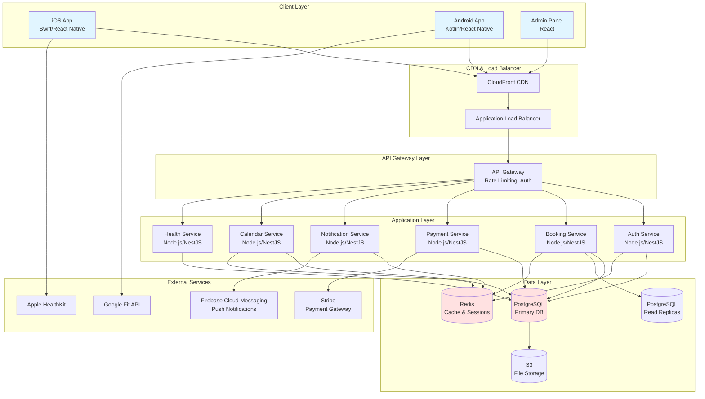
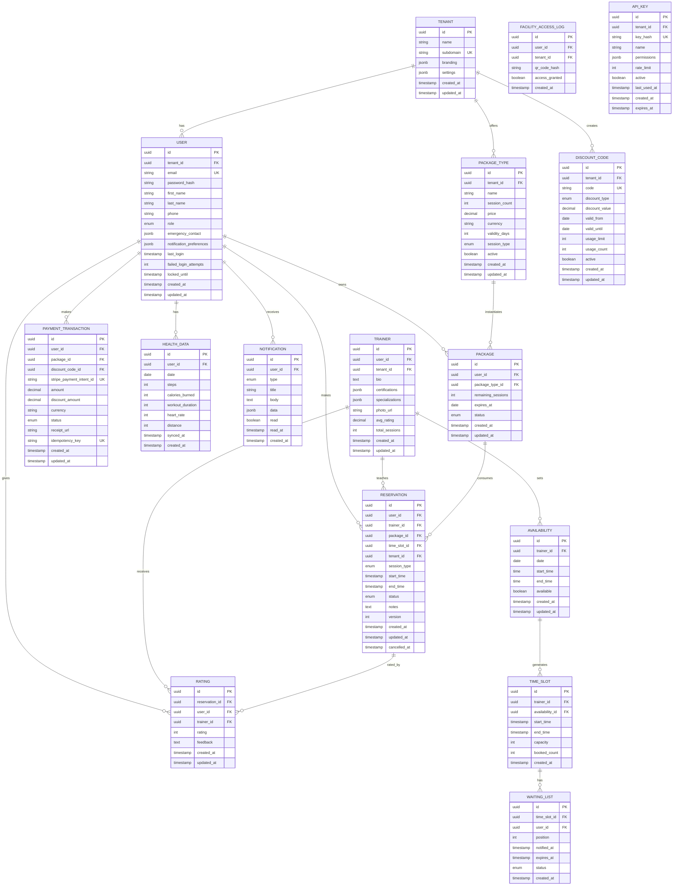
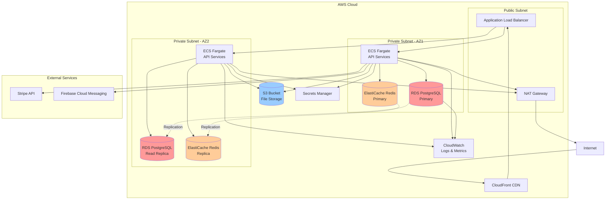

# Technical Design Document - Rezidans Fitness App

## Overview

Rezidans Fitness App, rezidanslarda bulunan fitness salonları için geliştirilecek multi-tenant SaaS platformudur. Sistem, üyelerin rezervasyon yapmasını, eğitmenlerin takvim yönetimini ve yöneticilerin operasyonel kontrolünü sağlayan kapsamlı bir çözümdür.

### System Goals

- **Multi-Tenancy**: Her rezidans/spor salonu bağımsız, izole veri ile çalışabilmeli
- **Scalability**: 100+ tenant ve 10,000+ concurrent user desteği
- **Real-time**: Rezervasyon ve bildirimler için gerçek zamanlı güncellemeler
- **Security**: GDPR uyumlu, güvenli ödeme ve veri şifreleme
- **Performance**: %95 API istekleri <500ms, mobil uygulama <2s yükleme
- **Reliability**: %99.9 uptime, otomatik backup ve disaster recovery

### Key Technical Challenges

1. Multi-tenant veri izolasyonu ve performans optimizasyonu
2. Real-time rezervasyon güncellemeleri ve race condition önleme
3. Güvenli ödeme işleme ve PCI DSS compliance
4. Cross-platform mobil uygulama geliştirme
5. Health data entegrasyonu (HealthKit/Google Fit)
6. QR code generation ve validation
7. Horizontal scaling ve load balancing

## Architecture

### High-Level System Architecture



### Architecture Patterns

**Microservices Architecture**: Sistem, bağımsız deploy edilebilen servislerden oluşur:
- **Auth Service**: Kimlik doğrulama, yetkilendirme, session yönetimi
- **Booking Service**: Rezervasyon oluşturma, iptal, güncelleme
- **Payment Service**: Ödeme işleme, paket satın alma
- **Notification Service**: Push notification, email, in-app bildirimler
- **Calendar Service**: Takvim yönetimi, time slot yönetimi
- **Health Service**: Health data sync ve analiz

**API Gateway Pattern**: Tüm client istekleri API Gateway üzerinden geçer:
- Rate limiting (1000 req/hour per API key)
- Authentication ve authorization
- Request routing
- Response caching
- API versioning (/api/v1/, /api/v2/)

**CQRS Pattern**: Read ve write operasyonları ayrılır:
- Write operations → Primary PostgreSQL
- Read operations → Read replicas
- Cache-aside pattern ile Redis caching

**Event-Driven Architecture**: Servisler arası iletişim için event bus:
- Reservation created/cancelled/updated events
- Payment completed events
- Notification trigger events
- Calendar sync events

## Components and Interfaces

### 1. Authentication Service

**Responsibilities**:
- User authentication (email/password, OAuth 2.0)
- JWT token generation ve validation
- Role-based access control (RBAC)
- Session management
- Password reset ve account lockout

**API Endpoints**:

```typescript
POST   /api/v1/auth/register
POST   /api/v1/auth/login
POST   /api/v1/auth/logout
POST   /api/v1/auth/refresh-token
POST   /api/v1/auth/forgot-password
POST   /api/v1/auth/reset-password
GET    /api/v1/auth/me
```

**Interface**:

```typescript
interface AuthService {
  register(dto: RegisterDto): Promise<AuthResponse>;
  login(dto: LoginDto): Promise<AuthResponse>;
  logout(token: string): Promise<void>;
  refreshToken(refreshToken: string): Promise<AuthResponse>;
  validateToken(token: string): Promise<TokenPayload>;
  resetPassword(dto: ResetPasswordDto): Promise<void>;
}

interface AuthResponse {
  accessToken: string;
  refreshToken: string;
  expiresIn: number;
  user: UserDto;
}

interface TokenPayload {
  userId: string;
  tenantId: string;
  role: UserRole;
  iat: number;
  exp: number;
}
```

**Security Features**:
- Password hashing: bcrypt (cost factor 12)
- JWT signing: RS256 algorithm
- Token expiration: Access token 15min, Refresh token 7 days
- Account lockout: 5 failed attempts → 15 min lock
- Password complexity: Min 8 chars, uppercase, lowercase, number

### 2. Booking Service

**Responsibilities**:
- Rezervasyon oluşturma, güncelleme, iptal
- Time slot availability kontrolü
- Package balance yönetimi
- Concurrent booking race condition önleme
- Waiting list yönetimi

**API Endpoints**:

```typescript
GET    /api/v1/bookings
GET    /api/v1/bookings/:id
POST   /api/v1/bookings
PUT    /api/v1/bookings/:id
DELETE /api/v1/bookings/:id
GET    /api/v1/bookings/availability
POST   /api/v1/bookings/:id/cancel
POST   /api/v1/bookings/:id/rate
GET    /api/v1/bookings/waiting-list
POST   /api/v1/bookings/waiting-list/:slotId
```

**Interface**:

```typescript
interface BookingService {
  createBooking(dto: CreateBookingDto): Promise<Booking>;
  cancelBooking(bookingId: string, userId: string): Promise<void>;
  getAvailability(dto: AvailabilityQuery): Promise<TimeSlot[]>;
  joinWaitingList(slotId: string, userId: string): Promise<WaitingListEntry>;
  rateSession(bookingId: string, dto: RatingDto): Promise<Rating>;
}

interface CreateBookingDto {
  trainerId: string;
  timeSlotId: string;
  sessionType: SessionType;
  notes?: string;
}

interface TimeSlot {
  id: string;
  trainerId: string;
  startTime: Date;
  endTime: Date;
  available: boolean;
  capacity: number;
  booked: number;
}
```

**Concurrency Control**:
- Optimistic locking: Version field in database
- Distributed locking: Redis SETNX for critical sections
- Transaction isolation: SERIALIZABLE level for booking operations

### 3. Payment Service

**Responsibilities**:
- Paket satın alma işlemleri
- Stripe entegrasyonu
- Payment tokenization
- Refund işlemleri
- Transaction history

**API Endpoints**:

```typescript
POST   /api/v1/payments/purchase
POST   /api/v1/payments/refund
GET    /api/v1/payments/history
GET    /api/v1/payments/methods
POST   /api/v1/payments/methods
DELETE /api/v1/payments/methods/:id
POST   /api/v1/payments/webhook
```

**Interface**:

```typescript
interface PaymentService {
  purchasePackage(dto: PurchaseDto): Promise<PaymentResult>;
  refund(transactionId: string, amount: number): Promise<RefundResult>;
  addPaymentMethod(dto: PaymentMethodDto): Promise<PaymentMethod>;
  processWebhook(event: StripeEvent): Promise<void>;
}

interface PurchaseDto {
  packageId: string;
  paymentMethodId: string;
  discountCode?: string;
}

interface PaymentResult {
  transactionId: string;
  status: PaymentStatus;
  amount: number;
  currency: string;
  receiptUrl: string;
}
```

**Security**:
- PCI DSS compliance: Stripe handles card data
- Tokenization: Store only Stripe payment method IDs
- TLS 1.3: All payment data encrypted in transit
- Idempotency keys: Prevent duplicate charges
- Webhook signature verification: Validate Stripe webhooks

### 4. Notification Service

**Responsibilities**:
- Push notification gönderimi (FCM)
- Email notifications
- In-app notification center
- Notification preferences yönetimi
- Scheduled notifications (reminders)

**API Endpoints**:

```typescript
GET    /api/v1/notifications
PUT    /api/v1/notifications/:id/read
POST   /api/v1/notifications/preferences
GET    /api/v1/notifications/preferences
POST   /api/v1/notifications/test
```

**Interface**:

```typescript
interface NotificationService {
  sendPushNotification(dto: PushNotificationDto): Promise<void>;
  sendEmail(dto: EmailDto): Promise<void>;
  scheduleReminder(dto: ReminderDto): Promise<void>;
  updatePreferences(userId: string, prefs: NotificationPreferences): Promise<void>;
}

interface PushNotificationDto {
  userId: string;
  title: string;
  body: string;
  data?: Record<string, any>;
  priority: 'high' | 'normal';
}

interface NotificationPreferences {
  pushEnabled: boolean;
  emailEnabled: boolean;
  reservationConfirmation: boolean;
  reminder24h: boolean;
  reminder1h: boolean;
  packageLowBalance: boolean;
  promotions: boolean;
}
```

**Notification Types**:
- Reservation confirmed (immediate)
- Reminder 24h before session
- Reminder 1h before session
- Trainer cancelled session (immediate)
- Package low balance (2 or fewer units)
- Waiting list spot available (60s timeout)
- Promotional campaigns

### 5. Calendar Service

**Responsibilities**:
- Trainer availability yönetimi
- Time slot generation
- Recurring availability patterns
- Calendar synchronization
- Conflict detection

**API Endpoints**:

```typescript
GET    /api/v1/calendar/availability/:trainerId
POST   /api/v1/calendar/availability
PUT    /api/v1/calendar/availability/:id
DELETE /api/v1/calendar/availability/:id
GET    /api/v1/calendar/schedule/:trainerId
POST   /api/v1/calendar/recurring-pattern
```

**Interface**:

```typescript
interface CalendarService {
  setAvailability(dto: AvailabilityDto): Promise<Availability>;
  setRecurringPattern(dto: RecurringPatternDto): Promise<void>;
  getTrainerSchedule(trainerId: string, dateRange: DateRange): Promise<Schedule>;
  detectConflicts(trainerId: string, timeSlot: TimeSlot): Promise<Conflict[]>;
}

interface RecurringPatternDto {
  trainerId: string;
  dayOfWeek: number; // 0-6
  startTime: string; // HH:mm
  endTime: string; // HH:mm
  effectiveFrom: Date;
  effectiveUntil: Date;
}
```

### 6. Health Service

**Responsibilities**:
- HealthKit/Google Fit entegrasyonu
- Health data synchronization
- Trend analysis ve visualization
- Data privacy ve consent management

**API Endpoints**:

```typescript
POST   /api/v1/health/sync
GET    /api/v1/health/data
GET    /api/v1/health/trends
POST   /api/v1/health/consent
DELETE /api/v1/health/disconnect
```

**Interface**:

```typescript
interface HealthService {
  syncHealthData(userId: string, data: HealthDataDto): Promise<void>;
  getHealthData(userId: string, dateRange: DateRange): Promise<HealthData[]>;
  getTrends(userId: string, metric: HealthMetric, days: number): Promise<TrendData>;
  grantConsent(userId: string): Promise<void>;
  revokeConsent(userId: string): Promise<void>;
}

interface HealthDataDto {
  steps: number;
  caloriesBurned: number;
  workoutDuration: number; // minutes
  heartRate?: number;
  distance?: number; // meters
  timestamp: Date;
}
```

## Data Models

### Database Schema (PostgreSQL)



### Key Database Design Decisions

**Multi-Tenant Strategy**: **Shared Database with tenant_id**
- **Rationale**: 
  - Cost-effective for 100+ tenants
  - Easier maintenance ve updates
  - Better resource utilization
  - Simpler backup/restore
- **Implementation**:
  - Her tabloda `tenant_id` column (indexed)
  - Row-Level Security (RLS) policies
  - Application-level tenant filtering
  - Connection pooling per tenant

**Indexing Strategy**:
```sql
-- Composite indexes for multi-tenant queries
CREATE INDEX idx_user_tenant ON user(tenant_id, email);
CREATE INDEX idx_reservation_tenant_user ON reservation(tenant_id, user_id, start_time);
CREATE INDEX idx_reservation_tenant_trainer ON reservation(tenant_id, trainer_id, start_time);
CREATE INDEX idx_time_slot_trainer_time ON time_slot(trainer_id, start_time);
CREATE INDEX idx_package_user_status ON package(user_id, status, expires_at);

-- Partial indexes for active records
CREATE INDEX idx_active_reservations ON reservation(tenant_id, start_time) 
  WHERE status IN ('confirmed', 'pending');
CREATE INDEX idx_active_packages ON package(user_id, expires_at) 
  WHERE status = 'active';
```

**Partitioning Strategy**:
```sql
-- Partition reservation table by month for better performance
CREATE TABLE reservation (
    ...
) PARTITION BY RANGE (start_time);

CREATE TABLE reservation_2024_01 PARTITION OF reservation
    FOR VALUES FROM ('2024-01-01') TO ('2024-02-01');
-- ... monthly partitions
```

**Data Retention**:
- Reservations: 24 months (then archive to S3)
- Health data: 12 months
- Notifications: 90 days
- Access logs: 30 days
- Payment transactions: 7 years (compliance)

### Redis Cache Schema

```typescript
// Session storage
session:{userId} → { tenantId, role, ... } (TTL: 15min)

// User data cache
user:{userId} → UserDto (TTL: 5min)

// Package balance cache
package:balance:{userId} → number (TTL: 1min)

// Availability cache
availability:{trainerId}:{date} → TimeSlot[] (TTL: 30s)

// Distributed locks
lock:booking:{timeSlotId} → 1 (TTL: 10s)

// Rate limiting
ratelimit:{apiKey}:{window} → count (TTL: 1hour)

// QR code validation
qr:{qrCodeHash} → { userId, generatedAt } (TTL: 60s)

// Waiting list notifications
waitlist:notified:{userId}:{slotId} → 1 (TTL: 15min)
```

## Correctness Properties

*A property is a characteristic or behavior that should hold true across all valid executions of a system—essentially, a formal statement about what the system should do. Properties serve as the bridge between human-readable specifications and machine-verifiable correctness guarantees.*

### Property Reflection

After analyzing all acceptance criteria, I identified the following properties suitable for property-based testing. I've eliminated redundancies:

**Redundancies Eliminated**:
- Requirements 1.3 and 1.1 both test tenant data isolation → Combined into Property 1
- Requirements 4.4 and 4.1 both test package balance accuracy → Combined into Property 4
- Requirements 12.1, 12.2, and 3.7 all test cancellation refund logic → Combined into Property 7
- Requirements 13.1 and 13.3 both test availability updates and race conditions → Combined into Property 11

### Property 1: Tenant Data Isolation

*For any* API request with a valid authentication token, all returned data SHALL belong exclusively to the tenant associated with that token, and no data from other tenants SHALL be accessible.

**Validates: Requirements 1.1, 1.2, 1.3**

### Property 2: Authentication Session Binding

*For any* user authentication with valid credentials, the generated session token SHALL contain exactly one tenant_id, and that tenant_id SHALL match the user's tenant.

**Validates: Requirements 2.1, 2.2**

### Property 3: Role-Based Access Control

*For any* authenticated user with a specific role (Member, Trainer, Administrator), API requests SHALL be granted or denied access based on the role's permissions, and no user SHALL access resources outside their role's scope.

**Validates: Requirements 2.4**

### Property 4: Package Balance Invariant

*For any* member's package, the remaining session count SHALL always be greater than or equal to zero AND less than or equal to the original package size, and SHALL decrease by exactly 1 when a reservation is created and increase by exactly 1 when a refundable cancellation occurs.

**Validates: Requirements 3.3, 4.1, 4.4**

### Property 5: Reservation Time Slot Uniqueness

*For any* trainer and time slot, at most one active (confirmed or pending) reservation SHALL exist for that trainer at that specific time, preventing double-booking.

**Validates: Requirements 3.2**

### Property 6: Timezone Conversion Correctness

*For any* time slot with a UTC timestamp and any valid timezone, converting the timestamp to the target timezone and back to UTC SHALL produce the original timestamp (round-trip property).

**Validates: Requirements 3.6**

### Property 7: Cancellation Refund Policy

*For any* reservation cancellation, if the cancellation occurs at least 24 hours before the scheduled start time OR the cancellation is initiated by the trainer (regardless of timing), then exactly one package unit SHALL be refunded to the member's balance; otherwise, no refund SHALL occur.

**Validates: Requirements 3.7, 12.1, 12.2, 12.3**

### Property 8: Package Expiration Enforcement

*For any* package with an expiration date, if the current date is after the expiration date, then the package SHALL NOT be usable for creating new reservations, and the system SHALL reject booking attempts with an expired package.

**Validates: Requirements 4.7**

### Property 9: Trainer Availability Enforcement

*For any* time slot marked as unavailable by a trainer, booking attempts for that time slot SHALL be rejected, and only time slots marked as available SHALL accept new reservations.

**Validates: Requirements 5.2**

### Property 10: Calendar Synchronization Consistency

*For any* reservation state change (created, cancelled, updated), the trainer's calendar SHALL reflect the change, and querying the calendar SHALL return data consistent with the current reservation state.

**Validates: Requirements 5.4**

### Property 11: Concurrent Booking Race Condition Prevention

*For any* set of concurrent booking attempts on the same time slot, at most one attempt SHALL succeed in creating a reservation, and all other attempts SHALL receive a clear failure response indicating the slot is no longer available.

**Validates: Requirements 3.2, 13.1, 13.3, 13.4**

### Property 12: Occupancy Rate Calculation

*For any* set of time slots and reservations, the calculated occupancy rate SHALL equal (number of booked slots / total number of slots) * 100, and SHALL always be between 0 and 100 inclusive.

**Validates: Requirements 6.1**

### Property 13: Revenue Calculation Accuracy

*For any* set of payment transactions within a time period, the calculated total revenue SHALL equal the sum of all successful transaction amounts minus refunds, and SHALL never be negative.

**Validates: Requirements 6.2**

### Property 14: Report Export Data Integrity

*For any* report data exported to CSV or PDF format, parsing the exported file SHALL yield data identical to the source data, preserving all fields and values.

**Validates: Requirements 6.7**

### Property 15: QR Code Round-Trip Encoding

*For any* member ID and timestamp, encoding them into a QR code and then decoding the QR code SHALL produce the original member ID and timestamp (round-trip property).

**Validates: Requirements 7.2**

### Property 16: QR Code Temporal Validity

*For any* generated QR code with timestamp T, the code SHALL be valid if and only if the current time is within 60 seconds of T, and SHALL be rejected as expired otherwise.

**Validates: Requirements 7.1, 7.3, 7.4**

### Property 17: Facility Access Logging Completeness

*For any* QR code scan attempt (successful or failed), an access log entry SHALL be created with the member ID, timestamp, and access result, and no scan attempt SHALL go unlogged.

**Validates: Requirements 7.5**

### Property 18: Payment Tokenization Security

*For any* payment transaction, the stored payment information SHALL contain only tokenized references (Stripe payment method IDs), and SHALL NOT contain raw credit card numbers or CVV codes.

**Validates: Requirements 9.6**

### Property 19: Health Data User Association

*For any* health data sync operation, all synced health data SHALL be associated with the correct user ID, and querying health data for a user SHALL return only that user's data.

**Validates: Requirements 10.6**

### Property 20: Health Data Trend Calculation

*For any* set of health data points over N days, the calculated trend (average, min, max) SHALL accurately reflect the input data, and SHALL handle missing days gracefully.

**Validates: Requirements 10.5**

### Property 21: Reservation Status Filtering

*For any* set of reservations and a status filter (upcoming, completed, cancelled), the filtered results SHALL contain only reservations matching the specified status, and SHALL contain all reservations with that status.

**Validates: Requirements 11.4**

### Property 22: Automatic Reservation Completion

*For any* reservation with a scheduled end time T, if the current time is at least 1 hour after T and the reservation status is "confirmed", then the status SHALL automatically change to "completed".

**Validates: Requirements 11.5**

### Property 23: API Rate Limiting Enforcement

*For any* API key with a rate limit of N requests per hour, if more than N requests are made within a 1-hour window, then requests beyond the limit SHALL be rejected with HTTP 429 status code.

**Validates: Requirements 19.2**

### Property 24: Webhook Event Delivery

*For any* reservation event (created, cancelled, completed), if webhooks are configured, then a webhook POST request SHALL be sent to the configured endpoint with the event data.

**Validates: Requirements 19.3**

### Property 25: API Response Format Validity

*For any* API request, the response SHALL be valid JSON format with an appropriate HTTP status code (2xx for success, 4xx for client errors, 5xx for server errors).

**Validates: Requirements 19.4**

### Property 26: Localization Date/Time Formatting

*For any* date, time, or currency value and any supported locale (Turkish, English), the formatted output SHALL follow the locale's conventions (date format, time format, currency symbol).

**Validates: Requirements 20.5**

### Property 27: Rating Value Validation

*For any* session rating submission, the rating value SHALL be an integer between 1 and 5 inclusive, and values outside this range SHALL be rejected.

**Validates: Requirements 21.2**

### Property 28: Rating Feedback Length Validation

*For any* session rating feedback text, if the text length exceeds 500 characters, the submission SHALL be rejected with a validation error.

**Validates: Requirements 21.3**

### Property 29: Trainer Average Rating Calculation

*For any* trainer with N ratings, the calculated average rating SHALL equal the sum of all rating values divided by N, rounded to 2 decimal places, and SHALL be between 1.0 and 5.0 inclusive.

**Validates: Requirements 21.4**

### Property 30: Rating Edit Time Window

*For any* rating submission at time T, edit attempts SHALL be allowed if the current time is within 7 days of T, and SHALL be rejected if more than 7 days have passed.

**Validates: Requirements 21.6**

### Property 31: Waiting List Chronological Ordering

*For any* time slot's waiting list, members SHALL be ordered by their join timestamp in ascending order (first to join has position 1), and positions SHALL be sequential without gaps.

**Validates: Requirements 22.2**

### Property 32: Waiting List Timeout Removal

*For any* waiting list entry where a member was notified at time T, if the current time is at least 15 minutes after T and the member has not responded, then the entry SHALL be automatically removed from the waiting list.

**Validates: Requirements 22.4**

### Property 33: Waiting List Automatic Cleanup

*For any* waiting list entry for a time slot with start time T, if the current time is after T, then the entry SHALL be automatically removed from the waiting list.

**Validates: Requirements 22.6**

### Property 34: Discount Code Validation

*For any* discount code with expiration date E and usage limit L, the code SHALL be valid if the current date is before or equal to E AND the usage count is less than L, and SHALL be invalid otherwise.

**Validates: Requirements 24.2, 24.3**

### Property 35: Discount Calculation Accuracy

*For any* purchase with a valid discount code, if the discount type is percentage, the discount amount SHALL equal (original price * discount percentage / 100); if the discount type is fixed amount, the discount amount SHALL equal the discount value, and the final price SHALL never be negative.

**Validates: Requirements 24.2**

### Property 36: Discount Code Single Application

*For any* purchase attempt with multiple discount codes, at most one discount code SHALL be applied to the purchase, and the system SHALL reject attempts to stack multiple discounts.

**Validates: Requirements 24.5**

### Property 37: Campaign Performance Metrics

*For any* discount code, the calculated performance metrics (total usage count, total revenue generated) SHALL accurately reflect all transactions using that code, and SHALL be updated in real-time as new transactions occur.

**Validates: Requirements 24.4**

### Property 38: GDPR Data Export Completeness

*For any* user data export request, the exported JSON SHALL contain all personal data associated with the user (profile, reservations, payments, health data, ratings), and SHALL NOT contain data belonging to other users.

**Validates: Requirements 16.1**

### Property 39: GDPR Data Deletion Completeness

*For any* user account deletion request, after the deletion is processed, all personal data associated with the user SHALL be removed from the database, and subsequent queries for that user SHALL return no results.

**Validates: Requirements 16.2**

### Property 40: Audit Logging Completeness

*For any* access to personal data (read, update, delete), an audit log entry SHALL be created with the accessor's ID, the accessed user's ID, the operation type, and timestamp, and no data access SHALL go unlogged.

**Validates: Requirements 16.5**

<function_calls>
<invoke name="prework">
<parameter name="featureName">rezidans-fitness-app


## Error Handling

### Error Classification

**Client Errors (4xx)**:
- `400 Bad Request`: Invalid input data, validation failures
- `401 Unauthorized`: Missing or invalid authentication token
- `403 Forbidden`: Insufficient permissions for the requested operation
- `404 Not Found`: Requested resource does not exist
- `409 Conflict`: Resource conflict (e.g., double-booking attempt)
- `422 Unprocessable Entity`: Business logic validation failure
- `429 Too Many Requests`: Rate limit exceeded

**Server Errors (5xx)**:
- `500 Internal Server Error`: Unexpected server error
- `502 Bad Gateway`: External service failure (Stripe, FCM)
- `503 Service Unavailable`: Service temporarily unavailable
- `504 Gateway Timeout`: External service timeout

### Error Response Format

```typescript
interface ErrorResponse {
  error: {
    code: string;           // Machine-readable error code
    message: string;        // Human-readable error message
    details?: any;          // Additional error details
    timestamp: string;      // ISO 8601 timestamp
    requestId: string;      // Unique request ID for tracking
  };
}

// Example
{
  "error": {
    "code": "INSUFFICIENT_PACKAGE_BALANCE",
    "message": "You don't have enough sessions in your package to make this reservation.",
    "details": {
      "required": 1,
      "available": 0
    },
    "timestamp": "2024-01-15T10:30:00Z",
    "requestId": "req_abc123"
  }
}
```

### Error Handling Strategies

**Retry Logic**:
- Exponential backoff for transient failures (network errors, 503 errors)
- Maximum 3 retry attempts
- Idempotency keys for payment operations

**Circuit Breaker**:
- Protect against cascading failures from external services
- Open circuit after 5 consecutive failures
- Half-open state after 30 seconds
- Close circuit after 2 successful requests

**Graceful Degradation**:
- Cache fallback for read operations when database is unavailable
- Queue notifications for later delivery if FCM is down
- Return cached availability if real-time update fails

**Error Logging**:
- All errors logged with context (user ID, tenant ID, request ID)
- Structured logging (JSON format)
- Error aggregation and alerting (Sentry, CloudWatch)
- PII redaction in logs

### Validation Errors

**Input Validation**:
```typescript
// Example validation error response
{
  "error": {
    "code": "VALIDATION_ERROR",
    "message": "Input validation failed",
    "details": {
      "fields": {
        "email": "Invalid email format",
        "password": "Password must be at least 8 characters"
      }
    },
    "timestamp": "2024-01-15T10:30:00Z",
    "requestId": "req_abc123"
  }
}
```

**Business Logic Validation**:
- Package balance insufficient
- Time slot no longer available
- Reservation outside cancellation window
- Discount code expired or usage limit reached
- QR code expired

### External Service Failures

**Stripe Payment Failures**:
- Card declined → Return user-friendly message, allow retry
- Network timeout → Retry with idempotency key
- Webhook signature invalid → Log and alert, do not process

**FCM Notification Failures**:
- Invalid device token → Mark token as invalid, remove from user
- Network timeout → Queue for retry (max 3 attempts)
- Rate limit exceeded → Implement exponential backoff

**Health API Failures**:
- Permission denied → Prompt user to re-authorize
- Network timeout → Use cached data, retry on next sync
- Invalid data format → Log error, skip invalid records

## Testing Strategy

### Testing Approach

The testing strategy combines multiple testing methodologies to ensure comprehensive coverage:

1. **Property-Based Testing**: Verify universal properties across all inputs
2. **Unit Testing**: Test specific examples, edge cases, and error conditions
3. **Integration Testing**: Test external service integrations and API endpoints
4. **End-to-End Testing**: Test complete user workflows
5. **Performance Testing**: Verify system meets performance requirements
6. **Security Testing**: Verify security controls and data protection

### Property-Based Testing

**Framework**: fast-check (JavaScript/TypeScript)

**Configuration**:
- Minimum 100 iterations per property test
- Seed-based reproducibility for failed tests
- Shrinking enabled to find minimal failing examples

**Property Test Structure**:
```typescript
import fc from 'fast-check';

describe('Feature: rezidans-fitness-app, Property 5: Reservation Time Slot Uniqueness', () => {
  it('should prevent double-booking for the same trainer at the same time', () => {
    fc.assert(
      fc.property(
        fc.record({
          trainerId: fc.uuid(),
          timeSlot: fc.record({
            startTime: fc.date(),
            endTime: fc.date()
          }),
          members: fc.array(fc.uuid(), { minLength: 2, maxLength: 10 })
        }),
        async ({ trainerId, timeSlot, members }) => {
          // Arrange: Create time slot
          const slot = await createTimeSlot(trainerId, timeSlot);
          
          // Act: Attempt concurrent bookings
          const bookingPromises = members.map(memberId =>
            createReservation(memberId, slot.id).catch(e => e)
          );
          const results = await Promise.all(bookingPromises);
          
          // Assert: At most one booking succeeds
          const successCount = results.filter(r => r.id).length;
          expect(successCount).toBeLessThanOrEqual(1);
          
          // Assert: Failed bookings receive clear error
          const failures = results.filter(r => r.code);
          failures.forEach(failure => {
            expect(failure.code).toBe('TIME_SLOT_UNAVAILABLE');
          });
        }
      ),
      { numRuns: 100 }
    );
  });
});
```

**Property Test Coverage**:
- All 40 correctness properties defined in the design document
- Each property test tagged with feature name and property number
- Generators for domain objects (users, reservations, packages, etc.)
- Custom arbitraries for business constraints (valid time slots, package types)

### Unit Testing

**Framework**: Jest

**Coverage Target**: 80% code coverage

**Unit Test Focus**:
- Specific examples demonstrating correct behavior
- Edge cases (empty inputs, boundary values, null/undefined)
- Error conditions and validation failures
- Business logic functions (calculations, transformations)

**Example Unit Tests**:
```typescript
describe('BookingService', () => {
  describe('createReservation', () => {
    it('should create reservation with valid inputs', async () => {
      const reservation = await bookingService.createReservation({
        userId: 'user-123',
        trainerId: 'trainer-456',
        timeSlotId: 'slot-789',
        sessionType: 'personal-training'
      });
      
      expect(reservation.id).toBeDefined();
      expect(reservation.status).toBe('confirmed');
    });
    
    it('should reject reservation when package balance is zero', async () => {
      await expect(
        bookingService.createReservation({
          userId: 'user-with-zero-balance',
          trainerId: 'trainer-456',
          timeSlotId: 'slot-789',
          sessionType: 'personal-training'
        })
      ).rejects.toThrow('INSUFFICIENT_PACKAGE_BALANCE');
    });
    
    it('should reject reservation for unavailable time slot', async () => {
      await expect(
        bookingService.createReservation({
          userId: 'user-123',
          trainerId: 'trainer-456',
          timeSlotId: 'unavailable-slot',
          sessionType: 'personal-training'
        })
      ).rejects.toThrow('TIME_SLOT_UNAVAILABLE');
    });
  });
});
```

### Integration Testing

**Framework**: Jest + Supertest

**Integration Test Focus**:
- API endpoint testing (request/response validation)
- Database operations (CRUD, transactions, constraints)
- External service integrations (mocked)
- Authentication and authorization flows
- Multi-tenant data isolation

**Example Integration Tests**:
```typescript
describe('POST /api/v1/bookings', () => {
  it('should create reservation and return 201', async () => {
    const response = await request(app)
      .post('/api/v1/bookings')
      .set('Authorization', `Bearer ${validToken}`)
      .send({
        trainerId: 'trainer-456',
        timeSlotId: 'slot-789',
        sessionType: 'personal-training'
      });
    
    expect(response.status).toBe(201);
    expect(response.body.data.id).toBeDefined();
  });
  
  it('should return 401 without authentication token', async () => {
    const response = await request(app)
      .post('/api/v1/bookings')
      .send({
        trainerId: 'trainer-456',
        timeSlotId: 'slot-789',
        sessionType: 'personal-training'
      });
    
    expect(response.status).toBe(401);
  });
  
  it('should prevent cross-tenant data access', async () => {
    const response = await request(app)
      .post('/api/v1/bookings')
      .set('Authorization', `Bearer ${tenant1Token}`)
      .send({
        trainerId: 'trainer-from-tenant2',
        timeSlotId: 'slot-789',
        sessionType: 'personal-training'
      });
    
    expect(response.status).toBe(403);
  });
});
```

### End-to-End Testing

**Framework**: Playwright (mobile web), Detox (React Native)

**E2E Test Focus**:
- Complete user workflows (registration → booking → payment)
- Cross-platform compatibility (iOS, Android, Web)
- UI interactions and navigation
- Offline functionality
- Push notification handling

**Example E2E Test**:
```typescript
describe('Booking Workflow', () => {
  it('should complete full booking flow', async () => {
    // Login
    await loginPage.login('member@example.com', 'password123');
    
    // Navigate to booking screen
    await homePage.tapBookingButton();
    
    // Select trainer
    await bookingPage.selectTrainer('John Doe');
    
    // Select time slot
    await bookingPage.selectTimeSlot('2024-01-20 10:00');
    
    // Confirm booking
    await bookingPage.tapConfirmButton();
    
    // Verify confirmation
    await expect(bookingPage.confirmationMessage).toBeVisible();
    
    // Verify package balance decreased
    await homePage.navigate();
    const balance = await homePage.getPackageBalance();
    expect(balance).toBe(9); // Assuming started with 10
  });
});
```

### Performance Testing

**Framework**: k6

**Performance Test Focus**:
- API response times (<500ms for 95th percentile)
- Concurrent user load (10,000 concurrent users)
- Database query performance (<100ms for 99th percentile)
- Horizontal scaling verification
- Cache hit rates

**Example Performance Test**:
```javascript
import http from 'k6/http';
import { check, sleep } from 'k6';

export const options = {
  stages: [
    { duration: '2m', target: 100 },   // Ramp up to 100 users
    { duration: '5m', target: 100 },   // Stay at 100 users
    { duration: '2m', target: 1000 },  // Ramp up to 1000 users
    { duration: '5m', target: 1000 },  // Stay at 1000 users
    { duration: '2m', target: 0 },     // Ramp down to 0 users
  ],
  thresholds: {
    http_req_duration: ['p(95)<500'], // 95% of requests under 500ms
    http_req_failed: ['rate<0.01'],   // Less than 1% failure rate
  },
};

export default function () {
  const response = http.get('https://api.example.com/api/v1/bookings/availability', {
    headers: { Authorization: `Bearer ${__ENV.TOKEN}` },
  });
  
  check(response, {
    'status is 200': (r) => r.status === 200,
    'response time < 500ms': (r) => r.timings.duration < 500,
  });
  
  sleep(1);
}
```

### Security Testing

**Security Test Focus**:
- Authentication bypass attempts
- Authorization escalation attempts
- SQL injection prevention
- XSS prevention
- CSRF protection
- Rate limiting enforcement
- Data encryption verification

**Security Testing Tools**:
- OWASP ZAP for automated vulnerability scanning
- Manual penetration testing
- Dependency vulnerability scanning (npm audit, Snyk)
- Static code analysis (SonarQube)

### Test Data Management

**Test Data Strategy**:
- Factories for generating test data (users, reservations, packages)
- Database seeding for integration tests
- Isolated test databases per test suite
- Cleanup after each test (transactions, truncate tables)
- Anonymized production data for staging environment

**Example Test Factory**:
```typescript
export const userFactory = {
  build: (overrides?: Partial<User>): User => ({
    id: faker.string.uuid(),
    tenantId: faker.string.uuid(),
    email: faker.internet.email(),
    firstName: faker.person.firstName(),
    lastName: faker.person.lastName(),
    role: 'member',
    createdAt: new Date(),
    ...overrides,
  }),
  
  create: async (overrides?: Partial<User>): Promise<User> => {
    const user = userFactory.build(overrides);
    return await userRepository.create(user);
  },
};
```

### Continuous Integration

**CI Pipeline**:
1. Lint and format check (ESLint, Prettier)
2. Unit tests (Jest)
3. Integration tests (Jest + Supertest)
4. Property-based tests (fast-check)
5. Code coverage report (>80% required)
6. Security scanning (npm audit, Snyk)
7. Build Docker images
8. Deploy to staging environment
9. E2E tests on staging
10. Performance tests on staging

**CI Tools**: GitHub Actions, CircleCI, or GitLab CI

## Technology Stack Decisions

### Backend

**Framework**: Node.js with NestJS

**Rationale**:
- TypeScript support for type safety
- Modular architecture aligns with microservices
- Built-in dependency injection
- Excellent testing support
- Large ecosystem and community
- Good performance for I/O-bound operations

**Alternatives Considered**:
- **Go**: Better performance but smaller ecosystem, steeper learning curve
- **Python/Django**: Slower performance, less suitable for real-time features
- **Java/Spring Boot**: More verbose, heavier resource usage

### Database

**Primary Database**: PostgreSQL 15+

**Rationale**:
- ACID compliance for transactional integrity
- Excellent support for multi-tenant architecture (Row-Level Security)
- JSON/JSONB support for flexible data (branding, settings)
- Mature replication and partitioning
- Strong community and tooling
- PostGIS extension for potential location features

**Alternatives Considered**:
- **MongoDB**: Less suitable for complex transactions and relationships
- **MySQL**: Weaker JSON support, less advanced features

**Caching**: Redis 7+

**Rationale**:
- In-memory performance for session storage
- Distributed locking for race condition prevention
- Pub/sub for real-time updates
- TTL support for QR codes and rate limiting
- Persistence options for durability

### Mobile

**Framework**: React Native

**Rationale**:
- Single codebase for iOS and Android (cost-effective)
- Large developer community and ecosystem
- Good performance for most use cases
- Easy integration with native modules (HealthKit, Google Fit)
- Hot reloading for faster development
- Mature and battle-tested

**Alternatives Considered**:
- **Flutter**: Smaller ecosystem, Dart language less common
- **Native (Swift/Kotlin)**: Higher development cost, separate codebases

**State Management**: Redux Toolkit + RTK Query

**Navigation**: React Navigation

**UI Components**: React Native Paper (Material Design)

### Web Admin Panel

**Framework**: React 18+ with TypeScript

**Rationale**:
- Component-based architecture
- Large ecosystem and community
- Excellent developer tools
- Server-side rendering support (Next.js)
- Strong TypeScript integration

**UI Library**: Material-UI (MUI)

**State Management**: Redux Toolkit + RTK Query

**Data Visualization**: Recharts, Chart.js

### API Gateway

**Solution**: AWS API Gateway or Kong

**Rationale**:
- Built-in rate limiting
- Authentication integration
- Request/response transformation
- API versioning support
- Monitoring and analytics
- Scalability

### Real-Time Communication

**Solution**: WebSockets (Socket.IO)

**Rationale**:
- Bi-directional real-time communication
- Automatic reconnection
- Room-based broadcasting (per tenant)
- Fallback to polling if WebSocket unavailable
- Good mobile support

**Alternatives Considered**:
- **Server-Sent Events**: Unidirectional only
- **Polling**: Higher latency, more resource intensive

**Use Cases**:
- Real-time availability updates
- Waiting list notifications
- Calendar synchronization
- Admin dashboard live metrics

### Payment Gateway

**Solution**: Stripe

**Rationale**:
- PCI DSS compliant (handles card data)
- Excellent API and documentation
- Strong fraud prevention
- Supports multiple payment methods
- Webhook support for async events
- Good international support
- Transparent pricing

**Alternatives Considered**:
- **İyzico**: Turkey-focused, smaller international presence
- **PayTR**: Limited features compared to Stripe

### Push Notifications

**Solution**: Firebase Cloud Messaging (FCM)

**Rationale**:
- Free for unlimited notifications
- Supports both iOS and Android
- High delivery rates
- Topic-based messaging
- Analytics and reporting
- Easy React Native integration

**Alternatives Considered**:
- **OneSignal**: Additional cost, similar features
- **AWS SNS**: More complex setup, higher cost

### File Storage

**Solution**: AWS S3

**Rationale**:
- Highly scalable and durable (99.999999999%)
- Cost-effective for large files
- CDN integration (CloudFront)
- Lifecycle policies for archiving
- Versioning support
- Fine-grained access control

**Use Cases**:
- User profile photos
- Trainer photos
- Report exports (PDF, CSV)
- Database backups
- Application logs

### Deployment

**Platform**: AWS (Amazon Web Services)

**Rationale**:
- Comprehensive service offering
- Global infrastructure
- Mature and reliable
- Good pricing for startups (free tier)
- Excellent documentation
- Strong security features

**Architecture**:
- **Compute**: ECS (Elastic Container Service) with Fargate
- **Load Balancer**: Application Load Balancer (ALB)
- **Database**: RDS PostgreSQL with Multi-AZ
- **Cache**: ElastiCache Redis
- **Storage**: S3
- **CDN**: CloudFront
- **Monitoring**: CloudWatch
- **Secrets**: AWS Secrets Manager

**Alternatives Considered**:
- **Google Cloud**: Similar features, less mature
- **Azure**: More complex, enterprise-focused
- **Heroku**: Limited scalability, higher cost

### Monitoring and Observability

**Application Monitoring**: Sentry

**Rationale**:
- Real-time error tracking
- Performance monitoring
- Release tracking
- User feedback integration
- Source map support

**Logging**: CloudWatch Logs + ELK Stack (Elasticsearch, Logstash, Kibana)

**Metrics**: CloudWatch Metrics + Grafana

**Tracing**: AWS X-Ray or Jaeger

**Uptime Monitoring**: UptimeRobot or Pingdom

### CI/CD

**Platform**: GitHub Actions

**Rationale**:
- Integrated with GitHub
- Free for public repos, affordable for private
- Good marketplace for actions
- Matrix builds for multi-platform testing
- Secrets management

**Deployment Strategy**:
- Blue-green deployment for zero downtime
- Automated rollback on health check failure
- Canary releases for gradual rollout

## Deployment Architecture

### Infrastructure Diagram



### Scaling Strategy

**Horizontal Scaling**:
- **API Services**: Auto-scaling based on CPU (target 70%) and request count
- **Min instances**: 2 (for high availability)
- **Max instances**: 20 (can be increased based on load)
- **Scale-out trigger**: CPU > 70% for 2 minutes
- **Scale-in trigger**: CPU < 30% for 5 minutes

**Database Scaling**:
- **Read Replicas**: 2 read replicas for read-heavy operations
- **Connection Pooling**: PgBouncer for efficient connection management
- **Vertical Scaling**: Upgrade instance type for write-heavy loads
- **Partitioning**: Monthly partitions for reservation table

**Cache Scaling**:
- **Redis Cluster**: 3-node cluster with automatic failover
- **Cache-aside pattern**: Application manages cache population
- **TTL strategy**: Short TTLs (30s-5min) for frequently changing data

**CDN Caching**:
- **Static Assets**: Cached for 1 year (with versioning)
- **API Responses**: Cached for 30s-5min (based on endpoint)
- **Cache Invalidation**: On-demand via CloudFront API

### High Availability

**Multi-AZ Deployment**:
- Services deployed across 2 availability zones
- Automatic failover for database and cache
- Load balancer health checks every 30 seconds
- Unhealthy instances replaced automatically

**Database Backup**:
- Automated daily backups at 3 AM UTC
- 30-day retention for daily backups
- 12-month retention for monthly backups
- Point-in-time recovery (PITR) enabled
- Backups stored in separate region (disaster recovery)

**Disaster Recovery**:
- **RTO (Recovery Time Objective)**: 4 hours
- **RPO (Recovery Point Objective)**: 1 hour
- **DR Region**: Secondary AWS region for critical data
- **Failover Plan**: Documented runbook for manual failover

### Security Architecture

**Network Security**:
- VPC with public and private subnets
- Security groups for fine-grained access control
- NACLs for subnet-level protection
- NAT Gateway for outbound internet access from private subnets
- VPC Flow Logs for network monitoring

**Application Security**:
- TLS 1.3 for all external communication
- JWT tokens with RS256 signing
- API rate limiting (1000 req/hour per key)
- CORS configuration for web clients
- Helmet.js for HTTP security headers
- Input validation and sanitization
- SQL injection prevention (parameterized queries)
- XSS prevention (output encoding)

**Data Security**:
- Encryption at rest (AES-256) for database and S3
- Encryption in transit (TLS 1.3) for all communication
- Secrets stored in AWS Secrets Manager
- Database credentials rotated every 90 days
- PII data encrypted with separate keys
- Audit logging for all data access

**Authentication & Authorization**:
- Multi-factor authentication (MFA) for admin accounts
- Password hashing with bcrypt (cost factor 12)
- Account lockout after 5 failed attempts
- Session timeout after 15 minutes of inactivity
- Role-based access control (RBAC)
- Tenant-based data isolation

**Compliance**:
- GDPR compliance (data export, deletion, consent)
- PCI DSS compliance (via Stripe)
- SOC 2 Type II (planned)
- Regular security audits
- Penetration testing (annual)
- Vulnerability scanning (weekly)

### Monitoring and Alerting

**Application Metrics**:
- Request rate, error rate, latency (RED metrics)
- API endpoint performance
- Database query performance
- Cache hit/miss rates
- Queue depths and processing times

**Infrastructure Metrics**:
- CPU, memory, disk usage
- Network throughput
- Database connections
- Cache memory usage
- Load balancer metrics

**Business Metrics**:
- Active users (DAU, MAU)
- Reservations created/cancelled
- Revenue (daily, monthly)
- Package purchases
- Notification delivery rates

**Alerting**:
- **Critical**: Page on-call engineer (PagerDuty)
  - Service down (>5% error rate)
  - Database unavailable
  - Payment processing failures
- **Warning**: Slack notification
  - High latency (>1s for 95th percentile)
  - High CPU usage (>80%)
  - Low cache hit rate (<70%)
- **Info**: Email notification
  - Daily summary report
  - Weekly performance report

### Cost Optimization

**Estimated Monthly Costs** (for 100 tenants, 10,000 users):

- **Compute (ECS Fargate)**: $300-500
- **Database (RDS PostgreSQL)**: $200-400
- **Cache (ElastiCache Redis)**: $100-200
- **Storage (S3)**: $50-100
- **CDN (CloudFront)**: $50-100
- **Load Balancer**: $20-30
- **Monitoring**: $50-100
- **External Services**:
  - Stripe: 2.9% + $0.30 per transaction
  - FCM: Free
  - Sentry: $26-80

**Total**: ~$800-1,500/month (excluding transaction fees)

**Cost Optimization Strategies**:
- Reserved instances for predictable workloads (30-50% savings)
- Spot instances for non-critical batch jobs (70-90% savings)
- S3 lifecycle policies (move old data to Glacier)
- CloudFront caching to reduce origin requests
- Database query optimization to reduce instance size
- Auto-scaling to match demand

## Conclusion

This technical design document provides a comprehensive blueprint for building the Rezidans Fitness App. The architecture is designed to be:

- **Scalable**: Supports 100+ tenants and 10,000+ concurrent users
- **Reliable**: 99.9% uptime with multi-AZ deployment and automated failover
- **Secure**: GDPR compliant, PCI DSS compliant (via Stripe), encrypted data
- **Performant**: <500ms API response times, <2s mobile app load times
- **Maintainable**: Microservices architecture, comprehensive testing, monitoring

The technology stack leverages proven, mature technologies (Node.js, PostgreSQL, React Native) while maintaining flexibility for future enhancements. The multi-tenant architecture ensures data isolation and cost-effectiveness.

The 40 correctness properties defined in this document will be implemented as property-based tests to ensure the system behaves correctly across all possible inputs, providing a strong foundation for software correctness.

### Next Steps

1. **Review and Approval**: Stakeholder review of technical design
2. **Task Breakdown**: Create detailed implementation tasks
3. **Sprint Planning**: Prioritize features and plan sprints
4. **Development**: Implement features following TDD approach
5. **Testing**: Execute comprehensive test suite
6. **Deployment**: Deploy to staging and production environments
7. **Monitoring**: Set up monitoring and alerting
8. **Iteration**: Gather feedback and iterate
