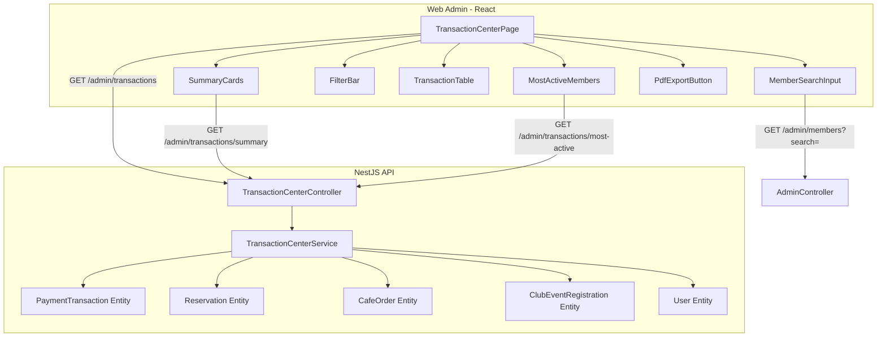

# Design Document: Transaction Center (İşlem Merkezi)

## Overview

Transaction Center is a centralized page in the web-admin panel where club administrators can view, filter, and report on all member service history (massage, PT, padel, cafe, events). The feature aggregates data from existing entities (`payment_transaction`, `reservation`, `cafe_order`, `club_event_registration`) into a unified view with member search, filters, summary cards, PDF export, and a "most active members" panel.

The design builds upon existing architectural patterns:

- **Backend**: NestJS module with controller/service separation, `@UseGuards(JwtAuthGuard, RolesGuard)` + `@Roles(UserRole.ADMINISTRATOR)` pattern, `@CurrentUser()` decorator for tenant isolation via `admin.tenantId`
- **Frontend**: React page component registered in `App.tsx` under the administrator `ProtectedRoute`, sidebar navigation via `AdminLayout.tsx` nav arrays, `apiJson()` helper for authenticated API calls with `X-Tenant-Subdomain` header

## Architecture



The backend introduces a new `TransactionCenterModule` with its own controller and service. It queries across existing entities using TypeORM query builder to produce a unified transaction list. No new database tables are needed — the feature is a read-only aggregation view over existing data.

## Components and Interfaces

### Backend API Endpoints

#### `GET /admin/transactions`

Returns a paginated, unified transaction list.

**Query Parameters:**
| Param | Type | Default | Description |
|-------|------|---------|-------------|
| page | number | 1 | Page number (1-indexed) |
| limit | number | 25 | Items per page (max 100) |
| memberId | uuid? | — | Filter by member |
| serviceType | enum? | — | massage, personal_training, padel, cafe, event |
| startDate | string? | — | ISO date YYYY-MM-DD |
| endDate | string? | — | ISO date YYYY-MM-DD |

**Response:**

```typescript
interface TransactionListResponse {
  data: TransactionRow[];
  meta: { page: number; limit: number; total: number; totalPages: number };
}

interface TransactionRow {
  id: string;
  date: string; // ISO timestamp
  memberName: string; // firstName + lastName
  memberId: string;
  serviceType: 'massage' | 'personal_training' | 'padel' | 'cafe' | 'event';
  description: string; // Package type name, service name, or event title
  amount: number; // Decimal as number
  currency: string; // TRY
  status: 'pending' | 'succeeded' | 'failed' | 'refunded';
}
```

#### `GET /admin/transactions/summary?memberId=&startDate=&endDate=`

Returns summary statistics for a specific member.

**Response:**

```typescript
interface TransactionSummary {
  totalSpending: number;
  totalSessions: number;
  lastVisitDate: string | null; // ISO date or null
}
```

#### `GET /admin/transactions/most-active?startDate=&endDate=`

Returns top 10 most active members.

**Response:**

```typescript
interface MostActiveMember {
  memberId: string;
  memberName: string;
  transactionCount: number;
  totalSpending: number;
}
```

#### `GET /admin/members/:userId/recent-transactions`

Returns last 5 transactions for member detail panel.

**Response:** `TransactionRow[]` (max 5 items)

### Frontend Components

| Component               | Responsibility                                                          |
| ----------------------- | ----------------------------------------------------------------------- |
| `TransactionCenterPage` | Page container, state management, filter orchestration                  |
| `MemberSearchInput`     | Debounced autocomplete using existing `/admin/members?search=` endpoint |
| `SummaryCards`          | Displays spending, sessions, last visit when member selected            |
| `FilterBar`             | Date range pickers + service type dropdown                              |
| `TransactionTable`      | Paginated table with sorting                                            |
| `MostActiveMembers`     | Sidebar panel showing top 10                                            |
| `PdfExportButton`       | Client-side PDF generation using jsPDF + jspdf-autotable                |

### Sidebar Integration

Add to both `WELLNESS_NAV` and `GENERIC_NAV` in `AdminLayout.tsx`:

```typescript
{ path: '/transaction-center', icon: '💳', label: 'İşlem Merkezi' }
```

### Route Registration

Add to `App.tsx` inside the `<ProtectedRoute allowedRoles={['administrator']}>` group:

```typescript
<Route path="/transaction-center" element={<TransactionCenterPage />} />
```

## Data Models

No new database tables are created. The `TransactionCenterService` aggregates across existing entities:

### Data Source Mapping

| Service Type      | Source Entity                                                            | Date Field               | Amount Field                 | Status Mapping                                         | Description Source                      |
| ----------------- | ------------------------------------------------------------------------ | ------------------------ | ---------------------------- | ------------------------------------------------------ | --------------------------------------- |
| massage           | `reservation` (sessionType=massage) + `payment_transaction`              | `reservation.startTime`  | `payment_transaction.amount` | PaymentStatus → direct                                 | `spa_service.name` or package type name |
| personal_training | `reservation` (sessionType=personal_training) + `payment_transaction`    | `reservation.startTime`  | `payment_transaction.amount` | PaymentStatus → direct                                 | Package type name                       |
| padel             | `reservation` (sessionType=other, with resource) + `payment_transaction` | `reservation.startTime`  | `payment_transaction.amount` | PaymentStatus → direct                                 | Resource name                           |
| cafe              | `cafe_order`                                                             | `cafe_order.createdAt`   | `cafe_order.totalAmount`     | pending→pending, completed→succeeded, cancelled→failed | "Kafe Siparişi"                         |
| event             | `club_event_registration`                                                | `registration.createdAt` | `club_event.price` or 0      | confirmed→succeeded, cancelled→failed                  | `club_event.title`                      |

### Tenant Isolation

All queries join through `user.tenantId` (for payment_transaction, reservation) or use direct `tenantId` column (cafe_order, club_event). The service always receives `tenantId` from `@CurrentUser()` decorator — never from request params.

```typescript
// Pattern used in service methods:
async getTransactions(tenantId: string, filters: TransactionFilters): Promise<...> {
  const qb = this.paymentRepo.createQueryBuilder('pt')
    .innerJoin('pt.user', 'u')
    .where('u.tenantId = :tenantId', { tenantId })
    // ... filters
}
```

## Correctness Properties

_A property is a characteristic or behavior that should hold true across all valid executions of a system — essentially, a formal statement about what the system should do. Properties serve as the bridge between human-readable specifications and machine-verifiable correctness guarantees._

### Property 1: Member search prefix matching

_For any_ set of members and any search query of 2+ characters, all returned members must have a case-insensitive prefix match in at least one of: firstName, lastName, or email.

**Validates: Requirements 2.3**

### Property 2: Member search result limit

_For any_ search query and any member dataset of size N, the number of returned results shall be at most min(N, 10).

**Validates: Requirements 2.4**

### Property 3: Unified transaction output completeness

_For any_ transaction returned by the unified endpoint, the record must contain a valid serviceType from the enum (massage, personal_training, padel, cafe, event), a valid status from (pending, succeeded, failed, refunded), a non-empty memberName, a numeric amount ≥ 0, and a valid ISO date.

**Validates: Requirements 3.1, 3.2, 3.6**

### Property 4: Transaction date sort invariant

_For any_ page of transaction results returned by the API (without explicit sort override), the dates must be in non-increasing (descending) order.

**Validates: Requirements 3.3**

### Property 5: Pagination size invariant

_For any_ request with a given page and limit parameter, the number of returned items shall be at most min(limit, remaining_items) and never exceed 100.

**Validates: Requirements 3.4, 9.5**

### Property 6: Filter composition correctness

_For any_ combination of date range [startDate, endDate] and service type filter applied simultaneously, every returned transaction must satisfy BOTH conditions: transaction date falls within [startDate, endDate] inclusive AND transaction serviceType matches the selected type.

**Validates: Requirements 4.2, 4.4, 4.5**

### Property 7: Date range validation

_For any_ date range where startDate > endDate, the system shall reject the filter and return a validation error without executing the query.

**Validates: Requirements 4.1, 4.7**

### Property 8: Summary card aggregation correctness

_For any_ member and date range, the summary totalSpending must equal the sum of amounts of all succeeded payment transactions within the range, totalSessions must equal the count of massage + PT + padel reservations within the range, and lastVisitDate must be the maximum reservation date with status completed within the range (or null if none).

**Validates: Requirements 5.2, 5.3, 5.4**

### Property 9: Currency formatting Turkish locale

_For any_ non-negative number, formatting it as Turkish Lira must produce a string matching the pattern `₺X.XXX,XX` where thousands are separated by dots and decimals by comma, with exactly 2 decimal places.

**Validates: Requirements 5.2, 7.3**

### Property 10: Most active members ranking correctness

_For any_ set of members with transaction data, the most active list must be sorted by transaction count descending, with ties broken by total spending descending, and contain at most 10 entries where each has at least 1 transaction.

**Validates: Requirements 7.2, 7.7**

### Property 11: Member detail recent transactions

_For any_ member, the "Son 5 İşlem" query must return at most 5 transactions sorted by date descending, and each row must contain a formatted date (DD.MM.YYYY), a service type name, and an amount with currency.

**Validates: Requirements 8.1, 8.4**

### Property 12: Tenant-isolated pagination

_For any_ authenticated admin request, all returned transactions must belong to users whose tenantId matches the requesting admin's tenantId, and the page must contain at most 100 items.

**Validates: Requirements 9.1, 9.5**

### Property 13: Tenant spoofing prevention

_For any_ request where an admin supplies a tenantId value different from their own (via query params or body), the system must ignore the supplied value and enforce the admin's actual tenantId from the JWT session.

**Validates: Requirements 9.4**

## Error Handling

| Scenario                         | Backend Response                                   | Frontend Behavior                                          |
| -------------------------------- | -------------------------------------------------- | ---------------------------------------------------------- |
| Invalid date range (start > end) | 400 Bad Request with message                       | Inline validation below date picker, no API call           |
| Missing/invalid tenant context   | 401/403                                            | Redirect to login (handled by existing `apiJson` 401 flow) |
| Database query timeout           | 500 Internal Server Error                          | "İşlemler yüklenemedi" error + retry button                |
| Member search timeout (>5s)      | 408/504                                            | Inline error "Arama şu an kullanılamıyor"                  |
| PDF generation client error      | N/A (client-side)                                  | Toast error "PDF oluşturulamadı"                           |
| Empty result sets                | 200 with empty data array                          | Contextual empty state messages                            |
| Page number exceeds total        | 200 with empty data, meta shows correct totalPages | Show last valid page or empty state                        |

## Testing Strategy

### Unit Tests (Example-based)

- Sidebar navigation: verify "İşlem Merkezi" entry exists in both nav arrays
- Route protection: verify route wrapped in administrator ProtectedRoute
- Empty states: verify correct messages for no results, no transactions, no member selected
- Error states: verify error messages and retry behavior
- PDF generation: verify document structure with known input
- Member detail link navigation with pre-selected member

### Property-Based Tests

- **Library**: [fast-check](https://github.com/dubzzz/fast-check) (already compatible with Jest in the project)
- **Configuration**: Minimum 100 iterations per property test
- Each property test tagged with: `Feature: transaction-center, Property {N}: {title}`
- Focus areas:
  - Search filtering logic (Properties 1, 2)
  - Transaction aggregation and mapping (Property 3)
  - Sort/pagination invariants (Properties 4, 5)
  - Filter composition (Properties 6, 7)
  - Summary aggregation math (Properties 8, 9)
  - Ranking algorithm (Property 10)
  - Recent transactions query (Property 11)
  - Tenant isolation (Properties 12, 13)

### Integration Tests

- End-to-end API calls with seeded multi-tenant data
- Verify cross-tenant data never leaks
- Verify pagination across large datasets
- Member search API with various query lengths

### Client-Side Tests

- PDF generation with jsPDF (verify output structure)
- Debounce behavior with mock timers
- Component rendering with React Testing Library
